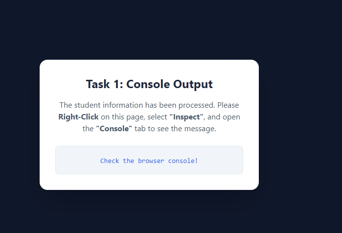
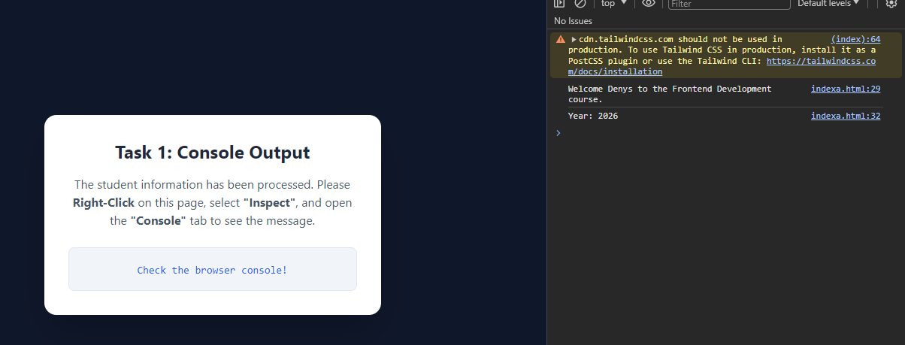
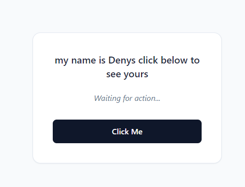
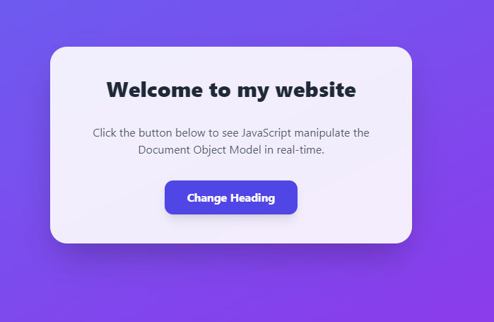
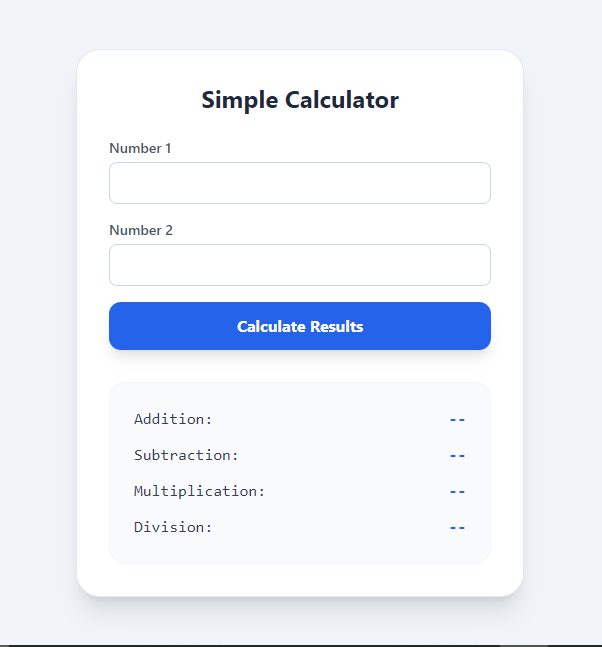
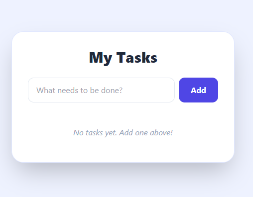

# JavaScript Fundamentals & Web Interaction
A comprehensive series of practical tasks demonstrating core JavaScript concepts, DOM manipulation, and modern styling using **Tailwind CSS**.

---

##  Project Overview
This project is a collection of 5 developmental tasks designed to master the bridge between logic (JavaScript) and interface (HTML/CSS). Every task is styled with a mobile-responsive, "Glassmorphism" aesthetic.

### 🛠️ Tech Stack
* **Language:** JavaScript (ES6+)
* **Structure:** HTML5
* **Styling:** Tailwind CSS (via Play CDN)
* **Concepts:** DOM Selection, Event Listeners, Arithmetic Logic, Dynamic Element Creation.

---

## Task Breakdown

### Task 1: Variable Declaration & Console Output
The foundation of the project. This script handles data storage using `const` and `let` and outputs a personalized welcome message to the developer console.
> **Key Concept:** Template Literals & Console Debugging. 
BEFORE  
 
AFTER 

---

### Task 2: Heading Toggle (DOM Selection)
Interactive header that changes text content upon a button click using `document.getElementById()`.
> **Key Concept:** Identifying elements and modifying `.textContent`.

---

### Task 3: Event Listeners
A minimalist interaction module that displays a "Success" message when a specific event is triggered.
> **Key Concept:** Using `.addEventListener('click', ...)` for cleaner, modern code.

---

### Task 4: Functional Calculator
A real-world tool that processes user input (Strings to Floats) and performs simultaneous arithmetic operations (Addition, Subtraction, Multiplication, Division).
> **Key Concept:** Data Type Conversion & Mathematical Operators.

---

### Task 5: Dynamic To-Do List (State Management)
The flagship task of this project. A fully functional task manager that allows users to:
*  **Add** tasks dynamically to the DOM.
* ✅ **Complete** tasks using class toggling (Bonus).
* 🗑️ **Remove** tasks using parent/child node manipulation.

---

## How to Run Locally
1. Clone this repository or download the source files.
2. Open any `.html` file (e.g., `task5.html`) in your preferred web browser.
3. **Note:** An active internet connection is required to load the Tailwind CSS CDN.

---

## 👨‍💻 Author
**[SHEMA KABIRIGI Denys - 25RP00642]** *IT Student & Aspiring Web Developer*

---